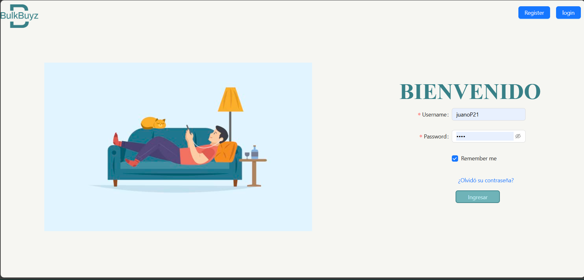

# Descripción
Este proyecto de e-comerce en **PROCESO** esta desarrollada en React en conjunto con node.js permitiendo a los usuarios contactar y comunicarse directamente con los proveedores, eliminando intermediarios. Inspirada en Alibaba, DirectMarket facilita un comercio electrónico eficiente y transparente, permitiendo transacciones rápidas y seguras. El proyecto tiene como objetivo conectar compradores y proveedores, reducir costos, ofrecer una experiencia de usuario intuitiva, garantizar transacciones seguras y fomentar la transparencia y la confianza. 

## 🛠️ Stack
- React.js 
- Javascript
- Redux
- Ant design
- Axios
- Node.js [Github](https://github.com/juano2123/Back)
- MongoDb 

# Ejecución

1.  Instalar las dependencias

    ```bash
    npm install
    ```
2. Correr la aplicación
    ```bash
    npm start
    ```
    
    
este el proyecto ya desplegado
<div align="center">
<a href="https://caliwood.netlify.app?id=proyector/">

</a>
<p></p>
</div>
